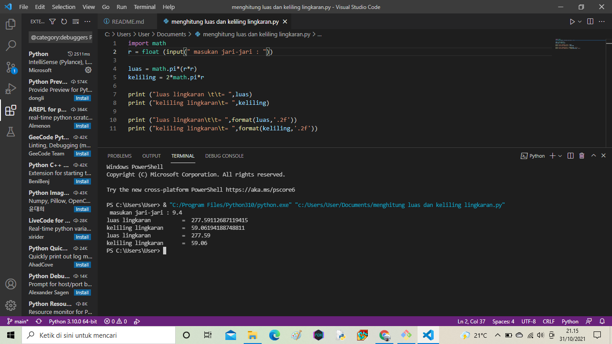
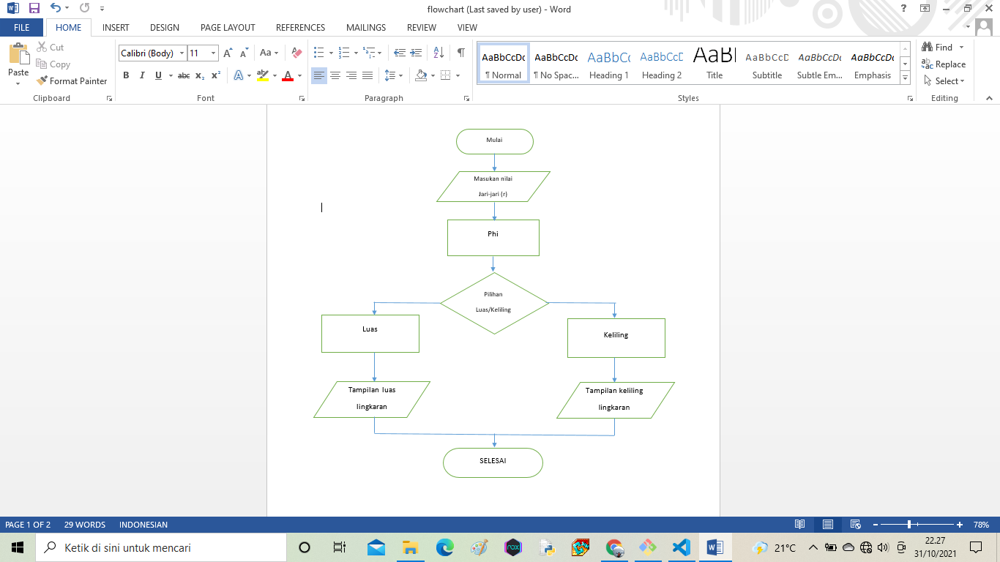

# Praktikum3
## Menghitung luas dan keliling lingkaran
-kita memerlukan nilai jari-jari (r) yang nantinya akan di masukan oleh pengguna pada layar console. Kita menggunakan fungsi input() yang nilainya di konversi ke tipe data float (bilangan riil). Ingat bahwa fungsi input() akan menganggap semua nilai inputan bertipe string, sehingga kita perlu melakukan konversi ke tipe yang diinginkan.
-fungsi print(). sintak \t merupakan karakter espace yang berfungsi untuk membuat tab. dalam kasus ini agar sejajar karakter sama dengan (=) nya.
-Jika dilihat hasil luas dan keliling lingkaran mempunyai angka pecahan yang cukup banyak, untuk mengambil 2 angka pecahan saja kita pakai fungsi format()

### Flowchart
-Algoritma Menghitung Luas dan Keliling Lingkaran
Setelah kalian tau tentang apa itu lingkaran, gambar lingkaran dan rumus untuk mencari luas dan keliling lingkaran, baru kita bisa lanjutkan untuk memberikan Algoritmanya. Adapun Algoritma Menghitung Luas dan Keliling Lingkaran sebagai berikut:
Mulai
Deklarasi variabel jari-jari (r), Luas (L) dan Keliling (K)
Masukkan nilai jari-jari (r)
Proses hitung Luas (L)  Lingkaran
Proses hitung Keliling (K) Lingkaran
Tampilkan Luas (L) Lingkaran
Tampilkan Keliling (K) Lingkaran
Selesai

Flowchart Menghitung Luas dan Keliling Lingkaran
Dari algoritma yang telah dibuat di atas, selanjutnya dapat dibuat flowchart. Flowchart untuk menghitung luas lingkaran dan keliling lingkaran dapat digambarkan sebagai berikut:
